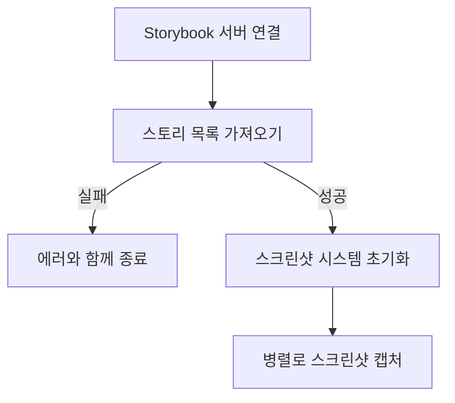

# Storyshot

Storybook 컴포넌트의 스크린샷을 캡처하는 도구입니다. 헤드리스 브라우저(Playwright)를 사용하여 Storybook의 각 스토리를 캡처하고 스크린샷 파일로 저장합니다.

[English Documentation](./README.md)

## 설치

npm을 통해 Storyshot을 설치할 수 있습니다:

```bash
npm install @hawke0204/storyshot
```

또는 GitHub 릴리즈 페이지에서 최신 버전을 다운로드할 수 있습니다:
https://github.com/geonhyeoklee/storyshot/releases

## 사용 방법

Storyshot은 Storybook 인스턴스의 스크린샷을 캡처하는 CLI 도구를 제공합니다:

```bash
npx storyshot --url <storybook-url>
```

### 옵션

- `--url`, `-u`: (필수) 스크린샷을 캡처할 Storybook URL
- `--help`, `-h`: 도움말 표시
- `--version`, `-v`: 버전 정보 표시

### 예시

```bash
# 로컬 Storybook에서 스크린샷 캡처
npx storyshot --url http://localhost:6006
```

## 동작 원리



## 라이선스

MIT
