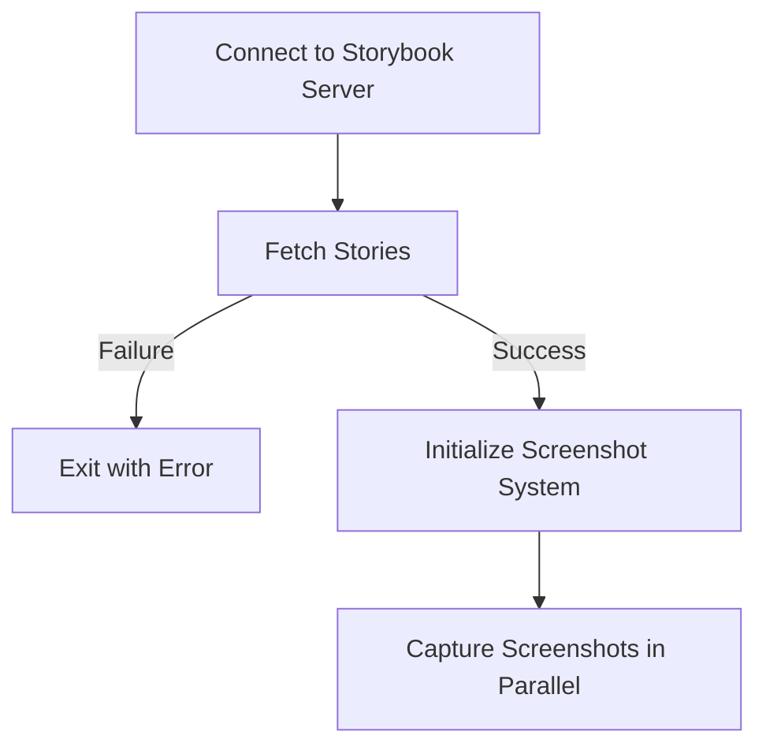

# Storyshot

A tool for taking screenshots of Storybook components. It uses a headless browser (Playwright) to capture each story in Storybook and save the screenshot files.

[한국어](./README.ko.md)

## Installation

You can install Storyshot using npm:

```bash
npm install @rock24/storyshot
```

Or download the latest release from GitHub:
https://github.com/geonhyeoklee/storyshot/releases

## Usage

Storyshot provides a CLI tool to capture screenshots from your Storybook instance:

```bash
npx storyshot --url <storybook-url>
```

### Options

- `--url`, `-u`: (Required) Storybook URL to capture screenshots from
- `--help`, `-h`: Show help
- `--version`, `-v`: Show version

### Example

```bash
# Capture screenshots from local Storybook
npx storyshot --url http://localhost:6006
```

## How it works



## License

MIT
